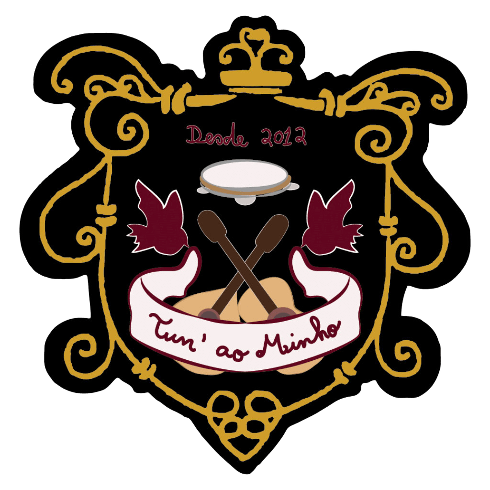
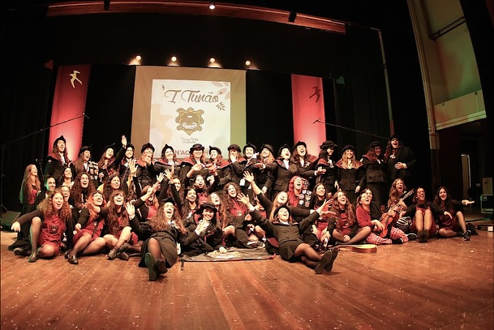

# Site html

## inicial.html


### Descrição
O ficheiro `inicial.html` corresponde à página principal do website da **Tun'ao Minho – Tuna Académica Feminina da Universidade do Minho**.  
Esta página foi desenvolvida utilizando **HTML para a estrutura**, **CSS para a estilização visual** e **JavaScript simples para a funcionalidade da galeria de imagens**.

---

# Estrutura do Documento HTML

O documento começa com a estrutura base de uma página HTML.

```html
<!DOCTYPE html>
<html lang="pt-br">
```

- `<!DOCTYPE html>` indica ao navegador que o documento utiliza **HTML5**.
- `<html lang="pt-br">` define a língua da página.

No `<head>` encontram-se configurações importantes da página:

```html
<meta charset="UTF-8">
<meta name="viewport" content="width=device-width, initial-scale=1.0">
<title>Tun'ao Minho</title>
```

- `charset="UTF-8"` permite utilizar caracteres especiais.
- `viewport` permite que a página seja **responsiva**, adaptando-se a dispositivos móveis.
- `title` define o nome apresentado no separador do navegador.

---

# Estilização com CSS

O CSS encontra-se dentro da tag `<style>` no `<head>` e define a aparência visual da página.

## Estilos Globais

```css
html {
    scroll-behavior: smooth;
}
```

Esta propriedade faz com que a navegação entre secções da página tenha **scroll suave**.

```css
body {
    font-family: 'Segoe UI', Tahoma, Geneva, Verdana, sans-serif;
}
```

Define a **fonte principal utilizada no site**.

---

# Associação entre CSS e HTML

Os estilos CSS são associados aos elementos HTML principalmente através de **classes**.

Exemplo no CSS:

```css
.menu {
    display: flex;
}
```

Aplicação no HTML:

```html
<nav class="menu">
```

Ou seja, todos os elementos com `class="menu"` irão receber os estilos definidos em `.menu`.

Alguns estilos aplicam-se diretamente a elementos HTML, por exemplo:

```css
section {
    padding: 20px 0;
}
```

Neste caso o estilo aplica-se automaticamente a todas as tags `<section>` da página.

---

# Pseudo-classes CSS

Alguns estilos não aparecem diretamente no HTML porque são ativados por interações do utilizador.

Exemplo:

```css
.menu a:hover {
    color: #000000;
}
```

`hover` é uma **pseudo-classe** que aplica um estilo quando o utilizador passa o rato sobre o elemento.

Outro exemplo:

```css
.evento:hover {
    transform: translateX(10px);
}
```

Neste caso o cartão do evento desloca-se ligeiramente quando o utilizador passa o cursor por cima.

---

# Estrutura da Página

## Header

O header contém o logótipo da tuna e o título principal da página.

```html
<header class="header-com-fundo">
```

A imagem de fundo do header é definida no CSS:

```css
.header-com-fundo {
    background-image: url("cjpg.jpg");
}
```

Para melhorar a legibilidade do texto sobre a imagem é utilizada uma camada escura chamada **overlay**:

```css
.overlay {
    background: rgba(0,0,0,0.5);
}
```

Esta camada é posicionada sobre a imagem mas abaixo do texto.

---

# Menu de Navegação

O menu utiliza Flexbox para organizar os links horizontalmente.

```css
.menu {
    display: flex;
    justify-content: center;
}
```

O menu também utiliza:

```css
position: sticky;
top: 0;
```

Isto faz com que o menu **permaneça fixo no topo da página enquanto o utilizador faz scroll**.

Cada link do menu aponta para uma secção específica da página:

```html
<a href="#sobre">Sobre</a>
```

Que corresponde a:

```html
<section id="sobre">
```

---

# Secções de Conteúdo

A página está dividida em várias secções principais:

- Sobre nós
- Percurso
- Atuações
- Junta-te a nós
- Galeria

Cada secção é criada utilizando a tag `<section>` e identificada com um `id` para permitir navegação através do menu.

---

# Secção Percurso

Esta secção apresenta estatísticas da tuna.

O layout utiliza **Flexbox**:

```css
.stats-container {
    display: flex;
    justify-content: space-around;
}
```

Cada estatística está dentro de:

```html
<div class="stat-item">
```

O número principal utiliza uma classe específica para aumentar o tamanho da fonte:

```css
.numero {
    font-size: 3rem;
}
```

---

# Lista de Eventos

A secção de atuações apresenta uma lista de eventos organizados verticalmente.

```css
.lista-eventos {
    display: flex;
    flex-direction: column;
}
```

Cada evento inclui:

- data
- nome do evento
- localização

Alguns eventos incluem links externos para publicações nas redes sociais.

---

# Galeria de Imagens

A galeria utiliza um **layout horizontal com scroll**.

```css
.grid-galeria {
    display: flex;
    overflow-x: hidden;
}
```

Isto coloca as imagens lado a lado.

Cada imagem ocupa toda a largura da galeria:

```css
.grid-galeria img {
    flex: 0 0 100%;
}
```

---

# Navegação da Galeria

A galeria possui botões de seta que permitem navegar entre as imagens.

```html
<button class="seta esquerda" onclick="document.querySelector('.grid-galeria').scrollBy({left: -300, behavior: 'smooth'})">❮</button>
```

A função `scrollBy()` desloca a galeria horizontalmente.

- valor negativo → imagem anterior  
- valor positivo → próxima imagem

O movimento é suave devido à propriedade `behavior: "smooth"`.

---

# Footer

O rodapé da página contém os contactos da tuna:

- Email
- Facebook
- Instagram

```html
<footer id="contactos">
```

O `id` permite que o menu navegue diretamente para esta secção.

---

## tunao.html

### Descrição
O ficheiro `tunao.html` corresponde à página dedicada ao **Tunão – Festival de Tunas Femininas**, organizado pela Tun'ao Minho.  
Esta página apresenta uma breve descrição do festival e uma galeria de imagens com momentos das edições anteriores.

A estilização CSS utilizada neste ficheiro é **praticamente idêntica à do ficheiro `inicial.html`**, utilizando as mesmas classes, organização e lógica de funcionamento. Por esse motivo, a explicação detalhada do CSS encontra-se na documentação da página inicial.

---

# Estrutura do Documento HTML

Tal como na página principal, o documento começa com a estrutura base de um ficheiro HTML.

```html
<!DOCTYPE html>
<html lang="pt-br">
```

- `<!DOCTYPE html>` define que o documento utiliza **HTML5**.
- `<html lang="pt-br">` define a língua do documento.

No `<head>` encontram-se as configurações principais da página:

```html
<meta charset="UTF-8">
<meta name="viewport" content="width=device-width, initial-scale=1.0">
<title>Tunão - Festival de Tunas Femininas</title>
```

Estas definições permitem:

- utilização correta de caracteres especiais
- adaptação da página a dispositivos móveis
- definição do título da página no navegador

---

# Estrutura da Página

A página encontra-se organizada em quatro partes principais:

- Menu de navegação
- Header
- Conteúdo principal
- Footer

---

# Menu de Navegação

O menu permite navegar entre páginas do site.

```html
<nav class="menu">
```

Os links presentes no menu são:

```html
<a href="inicial.html">Início</a>
<a href="festival.html">O Festival</a>
<a href="#contactos">Contactos</a>
```

- **Início** direciona para a página principal do site.
- **O Festival** corresponde à página atual.
- **Contactos** navega para o rodapé da página através de uma âncora interna.

---

# Header

O header apresenta o título do festival e utiliza uma imagem de fundo.

```html
<header class="header-com-fundo">
```

Dentro do header encontram-se dois elementos principais:

### Overlay

```html
<div class="overlay"></div>
```

Este elemento cria uma camada escura sobre a imagem de fundo, permitindo que o texto seja mais legível.

### Conteúdo do Header

```html
<div class="header-container">
```

Este bloco contém:

- o logótipo da tuna
- o título do festival
- um pequeno subtítulo

```html

```

A imagem representa o logótipo da Tun'ao Minho.

---

# Conteúdo Principal

Todo o conteúdo principal da página encontra-se dentro da tag:

```html
<main>
```

Esta área contém duas secções.

---

# Secção: Sobre o Tunão

```html
<section id="descricao-festival">
```

Esta secção apresenta um texto descritivo sobre o festival Tunão, incluindo:

- duração do festival
- principais eventos que o compõem
- locais onde decorrem as atividades
- referência à décima edição do festival

Esta informação serve para contextualizar o visitante sobre a importância e estrutura do evento.

---

# Secção: Galeria do Festival

```html
<section id="galeria-festival">
```

Esta secção apresenta uma **galeria de fotografias das edições anteriores do festival**.

A galeria é organizada dentro de um container:

```html
<div class="carousel-container">
```

Este container inclui:

- botão para imagem anterior
- conjunto de imagens
- botão para imagem seguinte

---

## Estrutura da Galeria

As imagens são colocadas dentro de:

```html
<div class="grid-galeria">
```

Cada imagem é adicionada através da tag:

```html

```

As imagens representam diferentes edições do festival.

---

# Navegação da Galeria

A navegação é feita através de botões com setas.

Exemplo:

```html
<button class="seta esquerda" onclick="document.querySelector('.grid-galeria').scrollBy({left: -600, behavior: 'smooth'})">❮</button>
```

A função `scrollBy()` desloca horizontalmente o conteúdo da galeria.

- valor negativo → desloca para a imagem anterior  
- valor positivo → desloca para a imagem seguinte

O parâmetro `behavior: "smooth"` permite que o movimento seja feito de forma suave.

---

# Footer

O rodapé da página contém as informações de contacto da tuna.

```html
<footer id="contactos">
```

Inclui:

- endereço de email
- página de Facebook
- perfil de Instagram
- direitos de autor

O `id="contactos"` permite que o link do menu navegue diretamente para esta secção da página.

